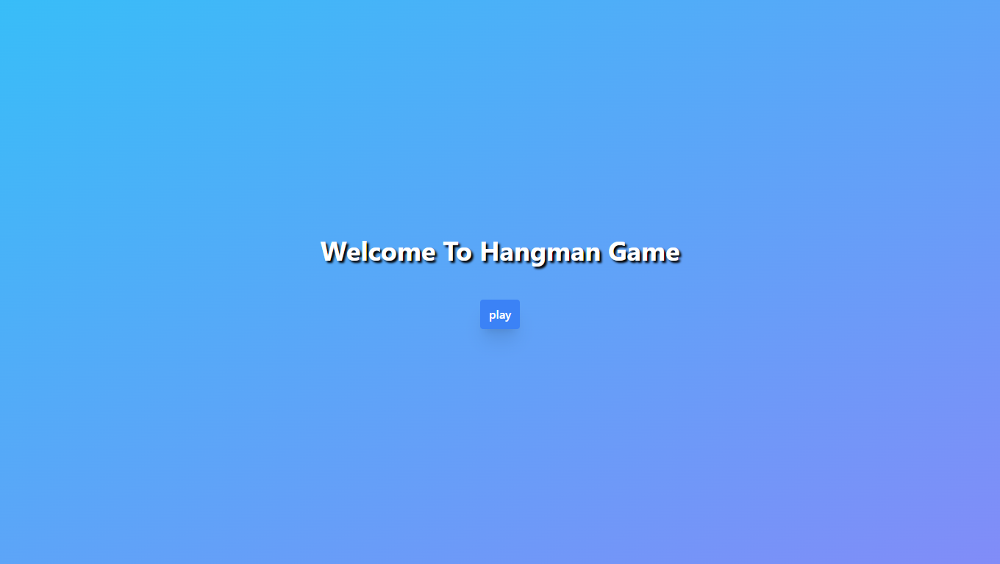
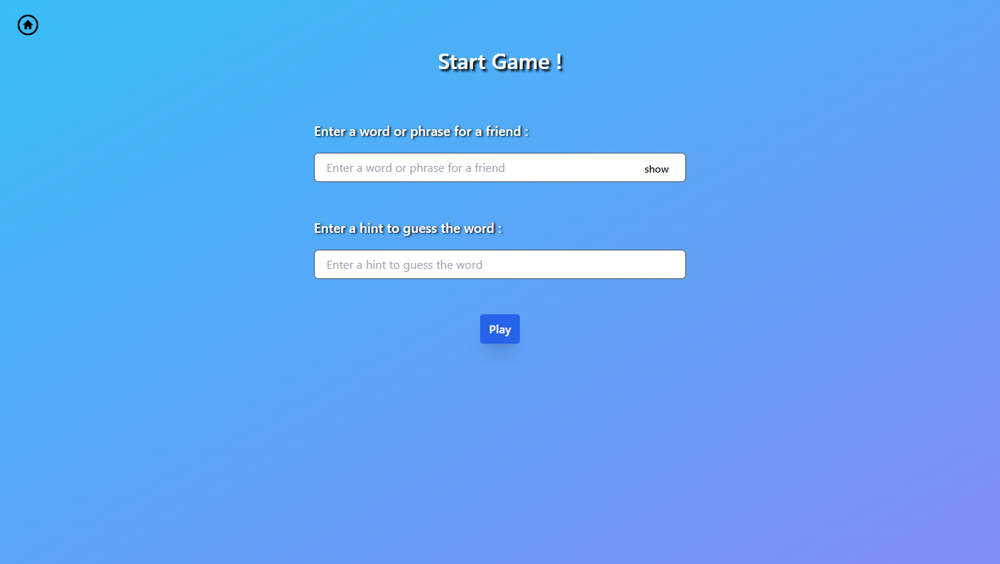
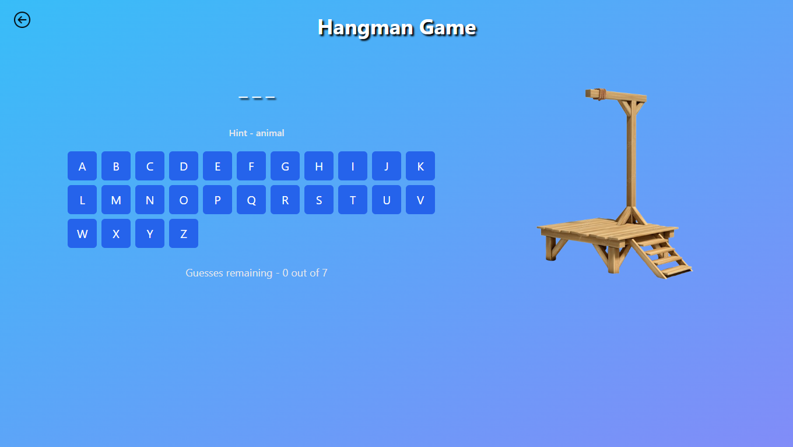
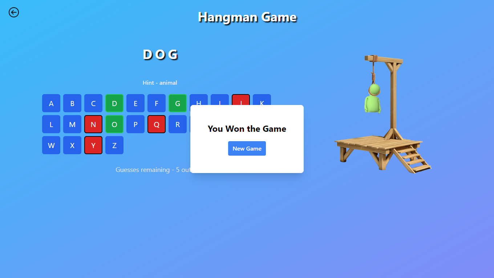

## Hangman Game

A classic Hangman game built using React JS and Tailwind CSS. The game allows a user to enter a word and provide a hint, then navigates to the game screen where another player can guess the word by clicking on an on-screen keyboard.

## Features

- User Input: The game allows one user to input a word to guess and provide a hint.
- Play Button: Clicking the "Play" button takes you to the game screen, using React Router for smooth navigation.
- Hint: A hint for the word is displayed to assist the player in guessing.
- On-Screen Keyboard: Players can guess the word by clicking letters on a virtual keyboard displayed on the screen.
- Responsive Design: The UI is built using Tailwind CSS, ensuring a responsive and user-friendly experience.

## Technologies Used

- React JS: For building the interactive UI components and managing state.
- React Router: For seamless page navigation between the input screen and game screen.
- Tailwind CSS: For styling and creating a responsive layout.

## Website Link

[Hangman Game](https://hangman-game-in-react.vercel.app/start)

## Project Screenshot

